# Отчет по лаборатороной работе №1

Были реализованые следующие алгоритмы:

- [Extendible Hash Table](./app/src/main/java/com/ruskaof/algorithm/ExtendibleHashTable.java)
- [Perfect Hash](./app/src/main/java/com/ruskaof/algorithm/PerfectHash.java)
- [LSH Hash Table](./app/src/main/java/com/ruskaof/algorithm/LshHashTable.java)

Сложности алгоритмов:

## Extendible Hash Table

Вставка амортизированно работает за O(1)

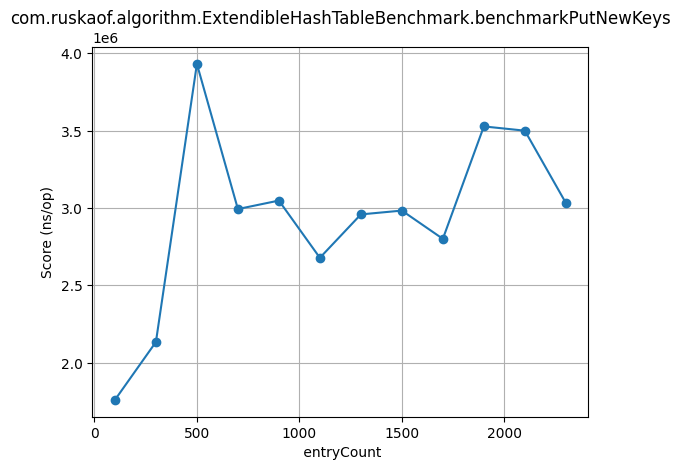

Получение: O(1)

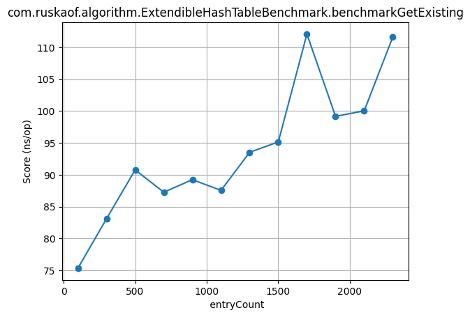

Профилирование

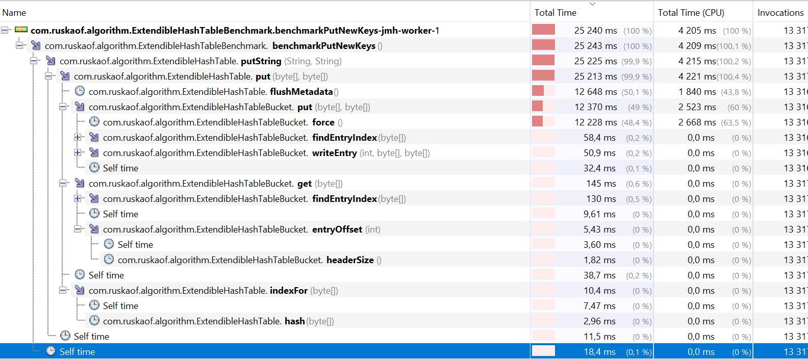

На графике `extendible_hash_put_prof.png` видно, что при вставке основное время тратится в методах `putString/put`, `flushMetadata`, а также в операциях записи бакета (`writeEntry`, `findEntryIndex`). Это говорит о высокой стоимости работы с диском/памятью и частых модификациях метаданных.

- Возможные улучшения вставки:
  - Снизить частоту `flushMetadata`: по возможности откладывать или батчить обновление метаданных, уменьшить количество синхронных flush-ов.
  - Оптимизировать структуру бакета: уменьшить число поисков индекса (`findEntryIndex`) за счёт более компактного формата или дополнительного индекса внутри бакета.
  - Упростить хеш‑функцию: профилирование показывает заметное время в `hash`, поэтому стоит использовать более дешёвый, но достаточно равномерный хеш.

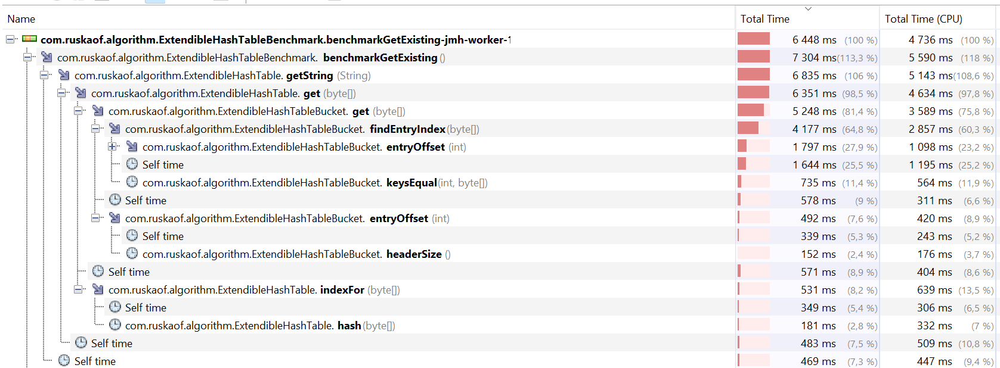

На графике `extendible_hash_get_prof.png` видно, что чтение времени в основном тратится в `get`, поиске индекса в бакете (`findEntryIndex`) и сравнении ключей (`keysEqual`).

## Perfect Hash

Создание в матожидании работает за O(n)

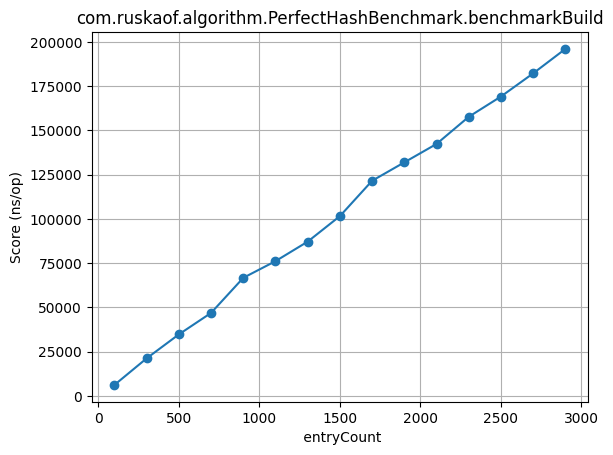

Получение: O(1)

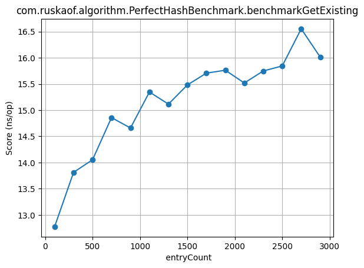

Профилирование

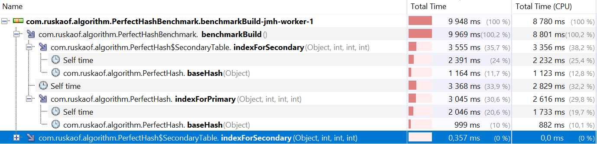

По профилю `perfect_hash_build_prof.png` большая часть времени тратится в вычислении индексов для вторичных таблиц (`indexForSecondary`) и базовой хеш‑функции (`baseHash`). Это ожидаемо, так как при построении требуется подобрать параметры, исключающие коллизии.

- **Возможные улучшения построения**:
  - **Упростить `baseHash`**: профайлер показывает заметный вклад этой функции, поэтому стоит уменьшить число операций внутри неё (меньше умножений/модулей, упрощённые константы).

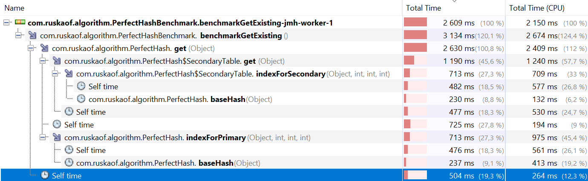

На графике `perfect_hash_get_prof.png` видно, что основные затраты - на хеш функцию.

## LSH Hash Table

Получение всех бакетов O(n)

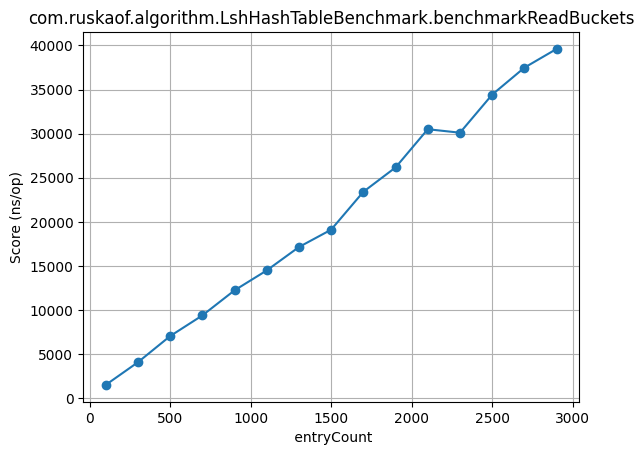

Создание O(n)

Вставка O(1)

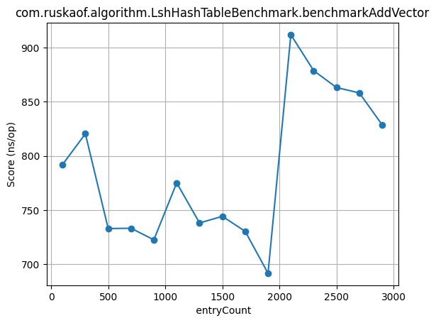

Профилирование

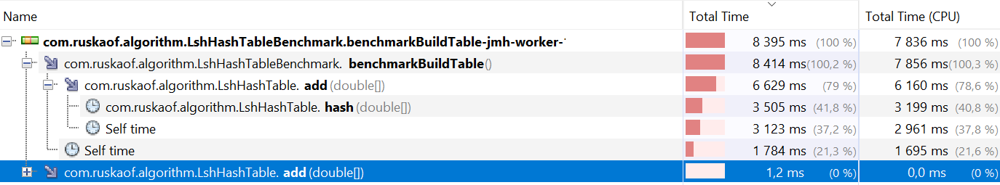

Профиль `lsh_build_bench.png` показывает, что при построении таблицы основное время тратится в методах `add(double[])` и `hash(double[])`. Это соответствует высокой стоимости вычисления нескольких хешей над вектором признаков и помещения его во все нужные бакеты.

- **Возможные улучшения LSH**:
  - **Сократить число хеш‑функций/таблиц** до минимально достаточного для качества поиска, чтобы уменьшить количество вызовов `hash` и `add`.

