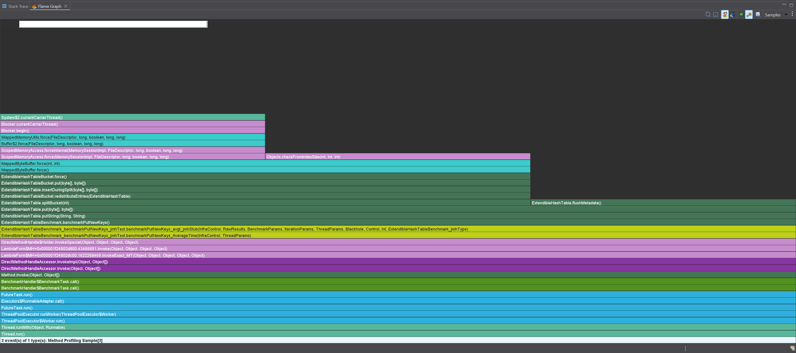
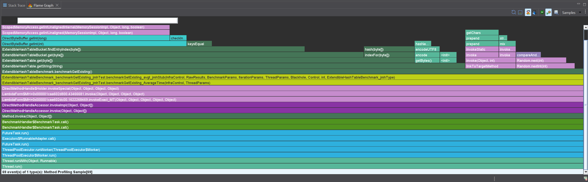
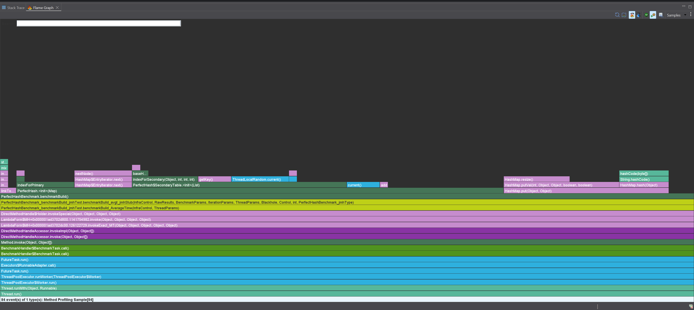
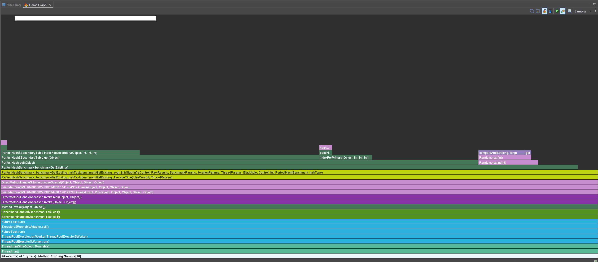
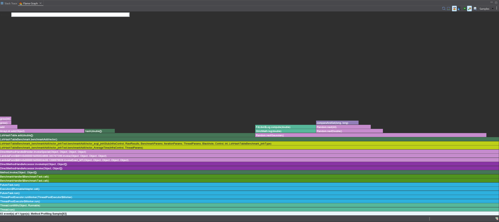

# Отчет по лаборатороной работе №1

Были реализованые следующие алгоритмы:

- [Extendible Hash Table](./app/src/main/java/com/ruskaof/algorithm/ExtendibleHashTable.java)
- [Perfect Hash](./app/src/main/java/com/ruskaof/algorithm/PerfectHash.java)
- [LSH Hash Table](./app/src/main/java/com/ruskaof/algorithm/LshHashTable.java)

Сложности алгоритмов:

## Extendible Hash Table

Вставка амортизированно работает за O(1)

Получение: O(1)

Профилирование

Абсолютно все время тратится на IO операцию с буфером для сохранения durability записей. Стоит батчевать флашинг буфера

Основное время тратится на использование буфера, вычисление хеша. Могут помочь оптимизации ОС или другая хеш функция

## Perfect Hash

Создание в матожидании работает за O(n)

Получение: O(1)

Профилирование

Из нашего кода основное время тратится только на вычисление случайных чисел

На графике `perfect_hash_get_prof.png` видно, что основные затраты - на хеш функцию.

## LSH Hash Table

Получение всех бакетов O(n)

Создание O(n)

Вставка O(1)

Профилирование

Больше всего времени (из того, что можно оптимизировать) тратится на вычисление хеш функции

