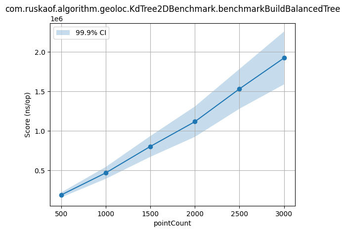
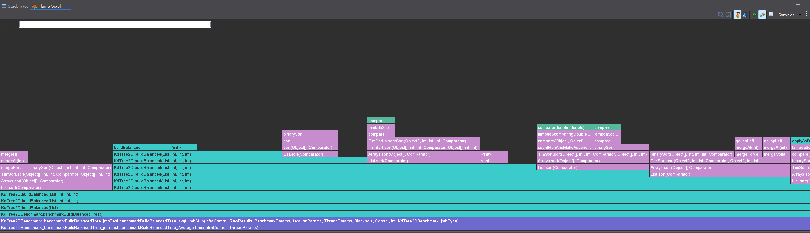
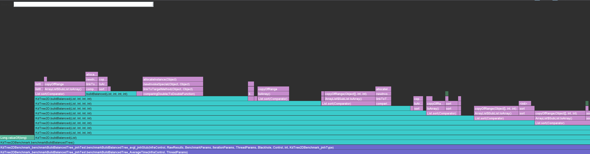
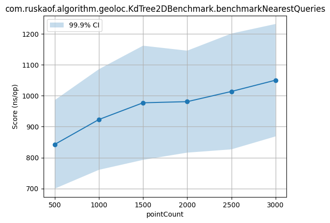
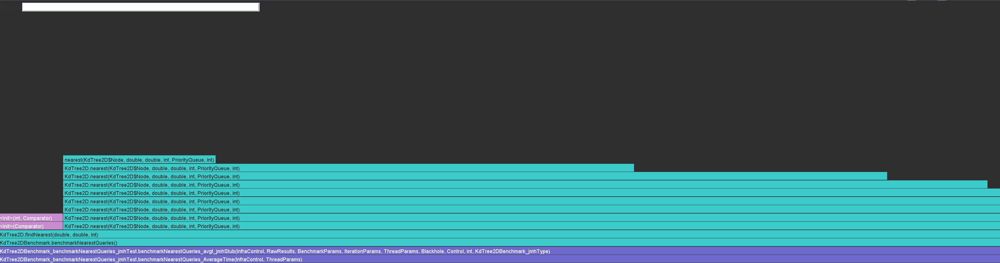
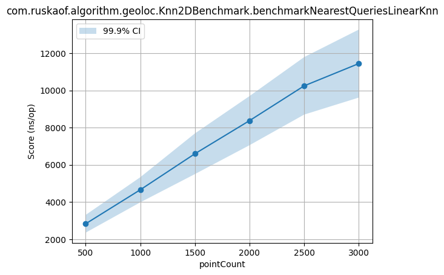

# Отчет по geoloc алгоритмам

Студент: Русинов Дмитрий

Содержание:
- [Задание](#задание)
- [Выполнение](#выполнение)
- [KdTree2D](#kdtree2d)
- [Knn2D](#knn2d)

## Задание

Домашнее задание 2: геопоиск по Lat/Lng по карте

Что должна уметь система:
- Помещать географически расположенные объекты
- Искать объекты по координатам — очевидно, не по точным (тут бы хватило любого KV), а близким

## Выполнение

Реализация выполнена на Java.

Реализации алгоритмов:
- [KdTree2D](../app/src/main/java/com/ruskaof/algorithm/geoloc/KdTree2D.java)
- [Knn2D](../app/src/main/java/com/ruskaof/algorithm/geoloc/Knn2D.java)

Бенчмарки:
- [KdTree2DBenchmark](../app/src/test/java/com/ruskaof/algorithm/geoloc/KdTree2DBenchmark.java)
- [Knn2DBenchmark](../app/src/test/java/com/ruskaof/algorithm/geoloc/Knn2DBenchmark.java)

### KdTree2D

В реализации есть два пути построения:
1. инкрементальный `add` (обычное дерево, чувствительно к порядку вставок)
2. `buildBalanced` (сбалансированное дерево через сортировку по оси на каждом уровне)

Поиск ближайших использует backtracking c отсечением по расстоянию до разделяющей гиперплоскости.

#### Построение

Время построения сбалансированного дерева растет почти линейно в тестируемом диапазоне, но заметно дороже линейного baseline (ожидаемо, так как есть рекурсивные разбиения и сортировки подмассивов).

Профилирование CPU построения:

Основные затраты ожидаемо приходятся на операции сортировки/работу с коллекциями при рекурсивной сборке.

Профилирование Memory построения:

#### Поиск ближайших

Поиск в KdTree2D растет очень слабо с увеличением числа точек (в текущем диапазоне почти плато), что соответствует идее пространственной отсечки.

Профилирование Memory поиска:

Много аллокаций уходит внутри сортировок

### Knn2D

`Knn2D` — baseline с линейным сканированием всех точек и max-heap размера `k`.

#### Поиск ближайших

Итого в измеренном диапазоне KdTree2D быстрее линейного baseline примерно в `3x-11x` для операции nearest query.
