# Отчет по лаборатороной работе №1

Студент: Русинов Дмитрий

## Задание

Необходимо реализовать три алгоритма (в скобках операции):

1. хэш таблицу на файловой системе с бакетами как мы обсуждали на паре (вставка, обновление и удаление)
2. perfect hash (создание полного индекса по фиксированному набору ключей и поиск)
3. lsh для поиска дублей в текстах или точек в 3d (создание индекса, добавление новых точек, фулл скан для поиска дублей)

По всем алгоритмам должны быть:
1. тесты функциональности на случайных наборах данных (набор данных при тесте генерируется) - очень помогает ловить корнер-кейсы
2. перфтесты на больших объемах данных - считаем пропускную способность и время операции
3. профайлинг памяти и цпу всех реализаций с анализом узких мест и набором гипотез как можно сделать лучше

## Выполнение

Для реализации алгоритмов был использован язык программирования Java.

### Extendible Hash Table

[Extendible Hash Table](../app/src/main/java/com/ruskaof/algorithm/ExtendibleHashTable.java)

Для mmap использует `java.nio.channels.FileChannel`. Все операции синхронизируются с диском.

#### Вставка

Вставка амортизированно работает за O(1), что видно на графике.

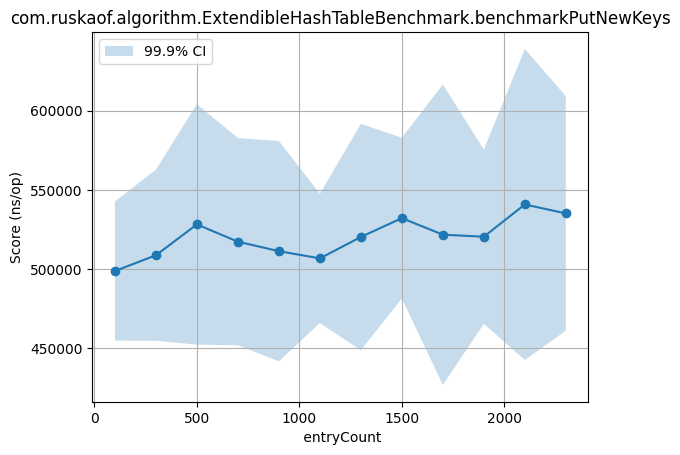

Профилирование CPU вставки:

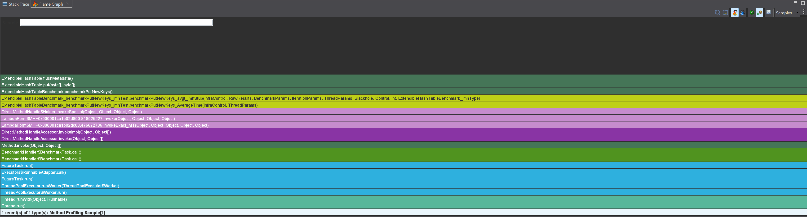

Почти все время тратится на флашинг операций в диск. Возможной оптимизацией могло бы стать батчевание флашей.

Профилирование Memory вставки:

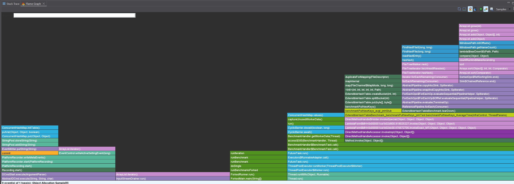

Все аллокации происходят только при созданиии бакета, не улучшить.

#### Получение

Алгоритмическая сложность получения - O(1), однако в бенчмарке мы можем видеть, что на самом деле время получения растет линейно с количеством записей в таблице. Это обуславливается ухудшением Cache locality. Больше записей -> больше бакетов -> хуже работает кеш ОС, чаще обращения в разные места

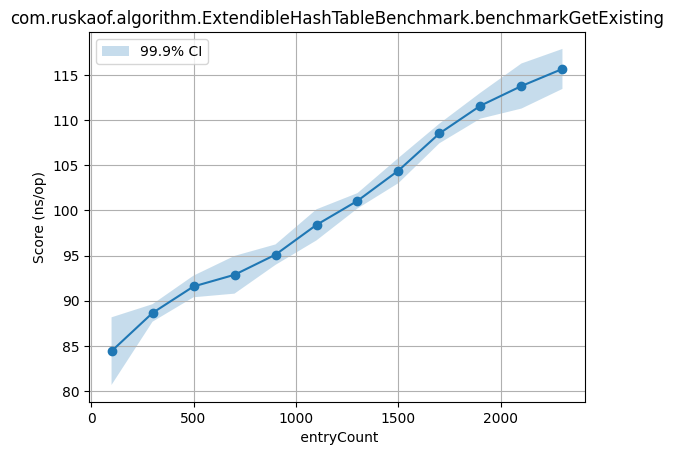

На графике ниже результаты бенчмарка, где каждый раз используется один и тот же ключ, что подтверждает теорию

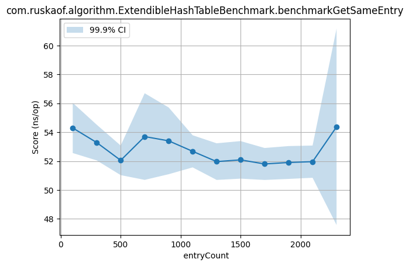

Профилирование CPU получения:

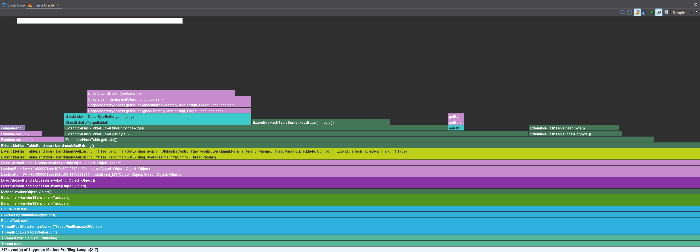

Все CPU уходит на работу с буфером и на сравнение ключей, его не улучшить.

Профилирование Memory получения:

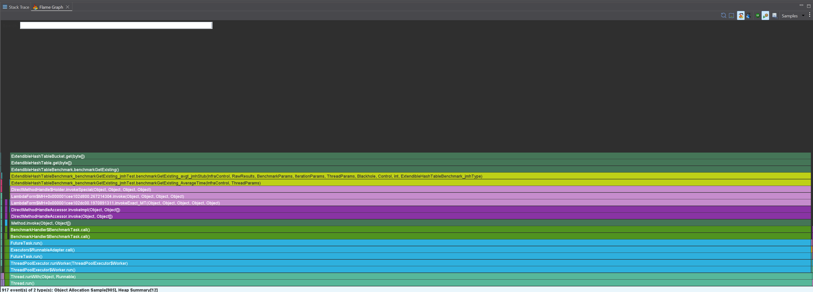

Похоже, что наш код не производит никаких аллокаций. Только при работе с бакетом есть аллокации на get, но вероятнее всего все они связаны с работой с буфером mmap.

### Pefrect Hash

- [Perfect Hash](../app/src/main/java/com/ruskaof/algorithm/PerfectHash.java)

Используется классическая реализация с одной вложенной хеш таблицей:

1. Пробуем собрать внутрении хеш таблицы вообще без коллизий, причем при их сборке выделяем им m^2 памяти, где m - количество ключей во вложенной хеш-таблице
2. Проверяем, что суммарно вложенные хеш таблицы занимают не более 4*n памяти, где n - общее количество ключей. Если занимают больше, то пробуем новую хеш-функцию

Статистически создание такой хеш таблицы будет проходить за около линейное время

#### Создание

Линейно зависит от количества ключей, как и предполагалось

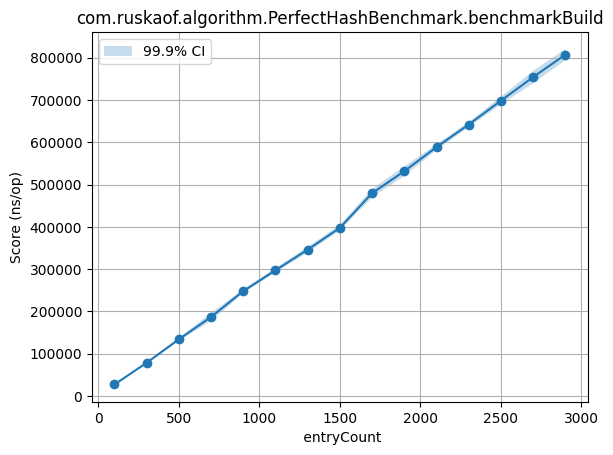

Профилирование CPU создания:

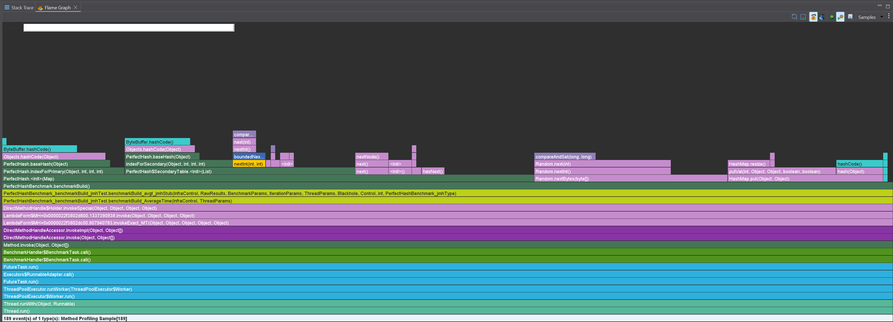

Почти все CPU уходит на вычисление хеш-функции и генерацию случайных чисел, что ожидаемо и нельзя улучшить

Профилирование Memory создания:

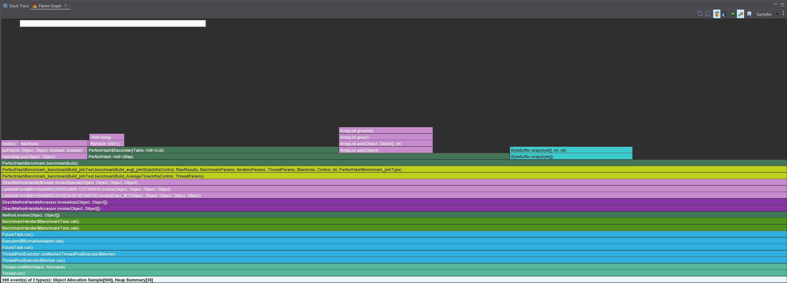

Все аллокации на внутренний `ArrayList` и работу с генерацией случайных чисел. Единственное возможное улучшение - использовать статический генератор, но количество его аллокаций и так не очень большое.

#### Получение

Алгоритмическая сложность - O(1), однако в бенчмарке заметная линейная зависимость. Предоложительно, опять влияние cache locality.

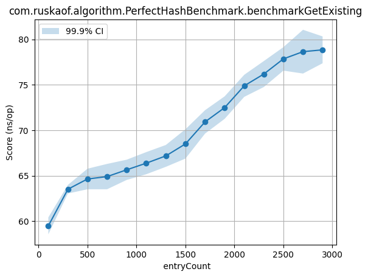

На графике ниже результаты бенчмарка, где каждый раз используется один и тот же ключ, что подтверждает теорию

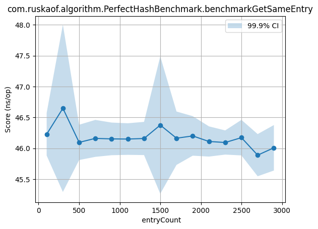

Профилирование CPU получения:

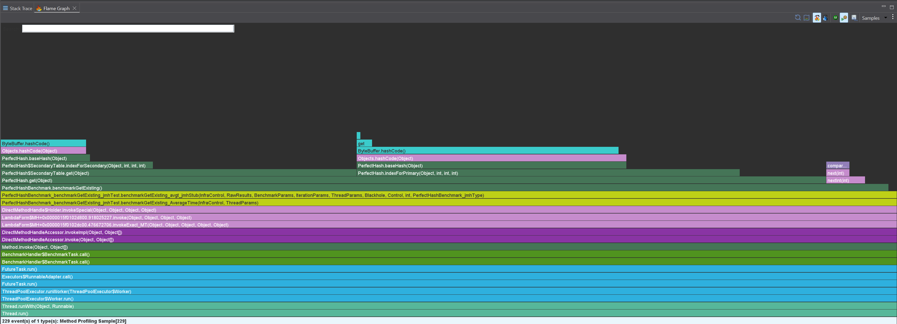

Все CPU уходит на вычисление хеша

Профилирование Memory получения:

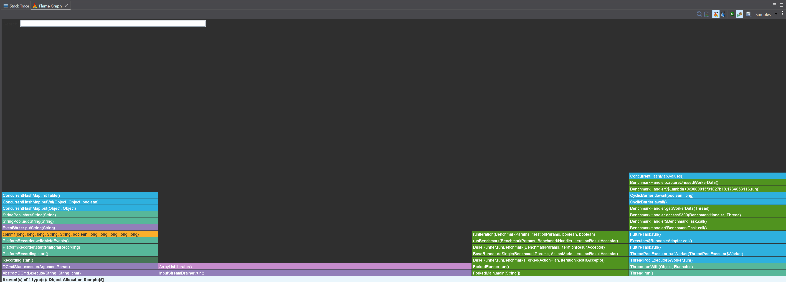

По сути, нет аллокаций вовсе

### LSH

- [LSH Hash Table](../app/src/main/java/com/ruskaof/algorithm/LshHashTable.java)

Выполнена реализация, которая схожие точки в векторном пространстве складывает в общие бакеты. Хеш функции - плоскости, параллельные некоторой оси координат. Реализация предполагает любую размерность векторов.

#### Добавление вектора

Константное время от количества записей, которые уже есть в таблице

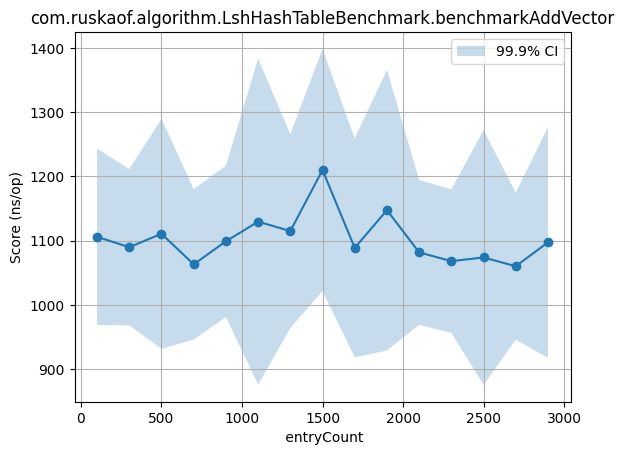

#### Создание

Линейное время от количества записей, как и ожидалось

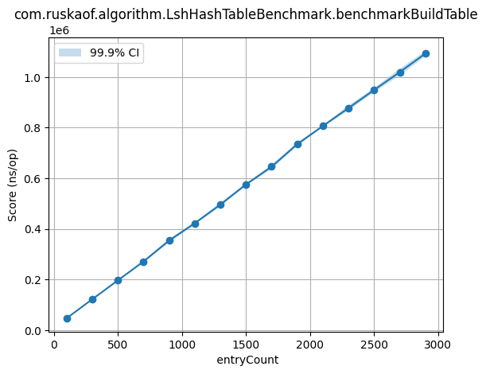

Профилирование CPU создания:

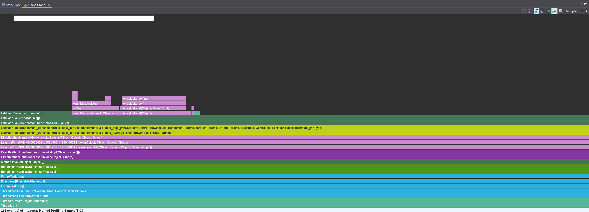

Вычисление кастомной хеш функции и работа с внутренними коллекциями занимают все время

Профилирование Memory создания:

Из аллокаций в нашем коде - только генератор случайных чисел, больше ничего.

#### Получение

Операция получения из таблицы LSH в реализации - это получение `List<List<Integer>>`, то есть получение всех существующих бакетов и идентификаторов векторов в них.

Работает за линейное время от количества записей, причем очень быстро, как и ожидалось.

Профилирование CPU получения:

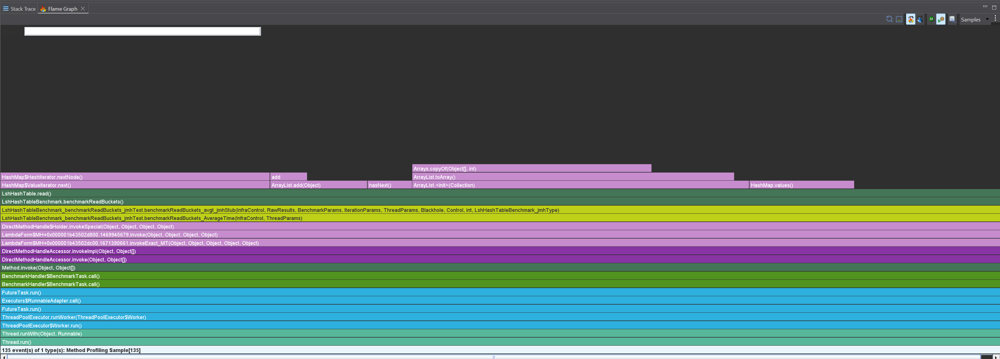

Все время занимает итерирование и создание структур, которые мы хотим вернуть

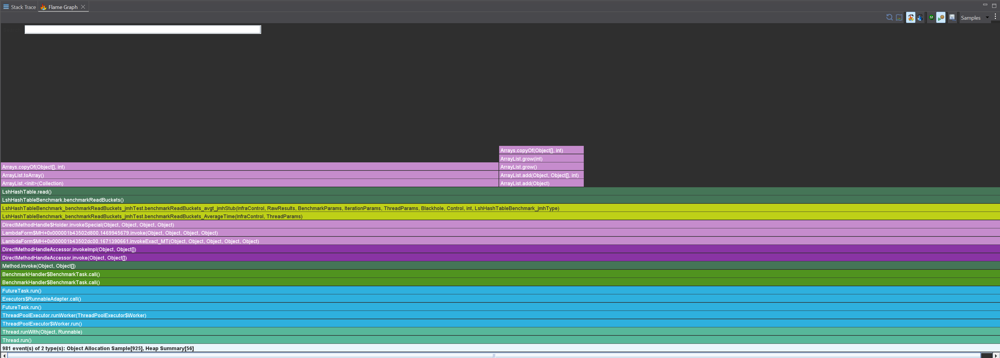

Все аллокации только под структуры, которые мы хотим вернуть